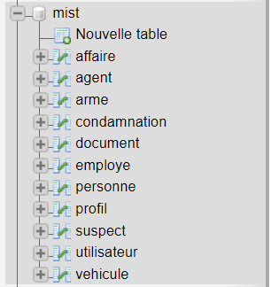
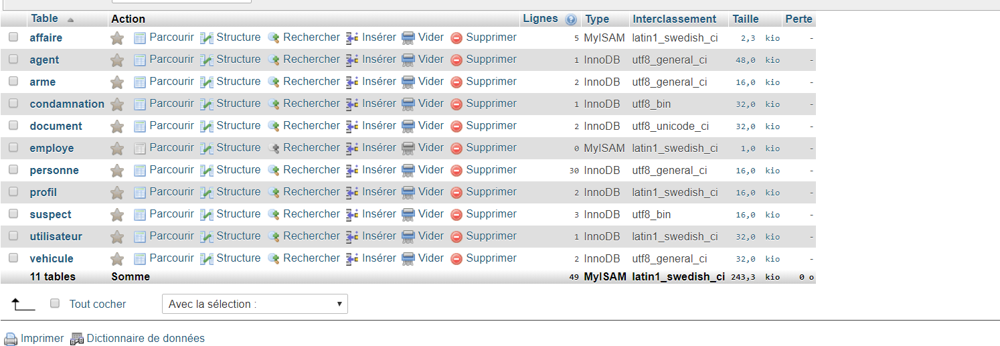

# Projet

Application spring boot basé sur une application permettant de gerer des affaires d'une equipe de police

La base de donnée Personne est commune aux bases Suspect et Agent
Elles possedent les memes attributs (nom, prenom,adresse, ville) et sont liées par leurs clefs primaires.
un supect est lié a des documents et des condamnations
chaque agent possede obligatoirement un profil ( admin ou utilisateur)


### Prérequis
- Java 1,8
- Maven 
- Git
- SGBDR MySQL
- mist.sql

### Installation serveur MYSQL

- Installer un serveur Mysql (https://www.mysql.com/fr/ dans la rubrique download ou de preference phpMyAdmin )
- lors de l'installation, laissez le port d'origine (3306)
- utiliser les identifiants de votre choix
- Une fois installé, verfier que le serveur Mysql est bien demarré
- se connecter a la base en utilisant :
        ```
        -hote : localhost
        -utilisateur et mot de passe : ceux renseignés lors de l'installation du logiciel
        -port : 3306
        ```
- importer le fichier mist.sql (situé dans dossier resources) dans le Systeme de gestion de BDD
- cela importera toutes les données utiles pour le bon fonctionnement de spring boot
- voici la base generée :






- pour l'instant un seul role ayant tous les privileges a été crée
        ```
        - utilisateur : directeur
        - mot de passe : miamicsi
        ```
- ce profil est celui qui a un controle total a la base de donnée mist


### Presentation api et contribution personnelle

**Table Agent basée sur un repository utilisatnt Datasource et Le driver JDBC:**

* **GET** /api/agent : liste les information de l'ensemble des instances de agent.
 * **GET** /api/agent/[id] : renvoie les informations d'une instance d'objet agent avec son id.
 * **POST** /api/agent : crée une nouvelle instance de agent avec les informations fournies.
 * **PUT** /api/agent/[id] : met à jour l'instance de agent correspondant à l'id fourni avec les informations fournies.
 * **DELETE** /api/agent/[id] : supprime l'instance de agent correspondant à l'id fourni.

 **Table Suspect basée sur des requetes hibernate :**

* **GET** /api/suspect : liste les information de l'ensemble des instances de suspect.
 * **GET** /api/suspect/[id] : renvoie les informations d'une instance d'objet suspect avec son id.
 * **DELETE** /api/suspect/[id] : supprime l'instance de suspect correspondant à l'id fourni.
 * **PUT** /api/suspect/[id] : met à jour l'instance de suspect correspondant à l'id fourni avec les informations fournies.
 * **DELETE** /api/suspect/[id] : supprime l'instance de suspect correspondant à l'id fourni.

**Table Profil basée sur des requetes hibernate :**
* **GET** /api/profil : liste les information de l'ensemble des instances de profil.
* **GET** /api/agent/[libelle] : renvoie les informations d'une instance d'objet profil avec son libelle.


 **Table documents et Condamnations : Requetes a venir**

### Installation du projet

Dans un repertoire de votre choix ouvrir GitBash et entrer la commande git clone https://github.com/jln06140/Crud_fil_rouge.git afin
de recuperer le projet

ouvrir une fenetre de ligne de commande et se postionner à la racine du projet cloné.


**Compilation**
```
mvn clean install -DskipTests
```

Une fois la compilation effectuée et build avec succes :

**Execution**
```
mvn spring-boot:run
```
Le serveur est demarré!


## Auteur

* **Nourry Jean-Luc** 
(https://github.com/jln06140)
Les documents tels que diagramme de classe et use case sont dans le dossier document


